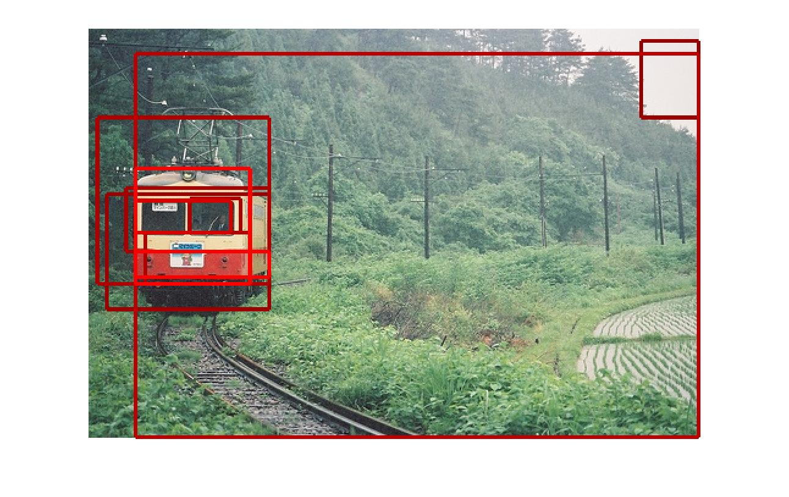
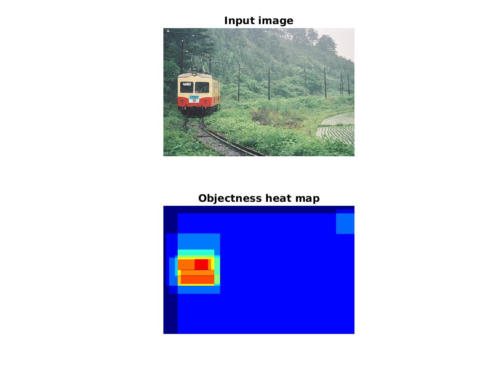

# python-objectness
Python implementation of PAMI 2012 paper "[Measuring the Objectness of Image Windows](https://doi.org/10.1109/TPAMI.2012.28)" and CVPR 2010 paper "[What is an object ?](https://ieeexplore.ieee.org/document/5540226/)".

This implementation is based on the [original matlab code](http://www.vision.ee.ethz.ch/~calvin).

## Results

Original matlab implementation:



This python implementation:


More comparisons of results can be found [here.](results/readme.md)

## Get started

1. Clone this repository into your computer:

    `git clone https://github.com/RookieHong/python-objectness.git`

2. Install the [requirements](#Requirements) below.

3. Run the `demo.py` and you can see the results:

    `python demo.py`

## Requirements
- numpy
- python-opencv
- easydict
- mat4py
- numba

## Notes

Because the implementation of many functions in MATLAB and numpy is different, the results are different from the original code.

The superpixel computation code in `py-segment` folder is modified from a [python implementation](https://github.com/luisgabriel/image-segmentation), so this will also cause differences in code results. I'm working to provide a python interface for the original C++ [code](http://cs.brown.edu/~pff/segment/).

## Citation

If you find this repository useful, consider citing their paper:

```
@article{alexe2012measuring,
  title={Measuring the objectness of image windows},
  author={Alexe, Bogdan and Deselaers, Thomas and Ferrari, Vittorio},
  journal={IEEE transactions on pattern analysis and machine intelligence},
  volume={34},
  number={11},
  pages={2189--2202},
  year={2012},
  publisher={IEEE}
}
```

```
@inproceedings{alexe2010object,
  title={What is an object?},
  author={Alexe, Bogdan and Deselaers, Thomas and Ferrari, Vittorio},
  booktitle={2010 IEEE computer society conference on computer vision and pattern recognition},
  pages={73--80},
  year={2010},
  organization={IEEE}
}
```