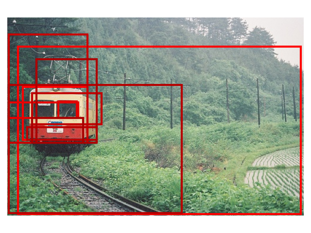
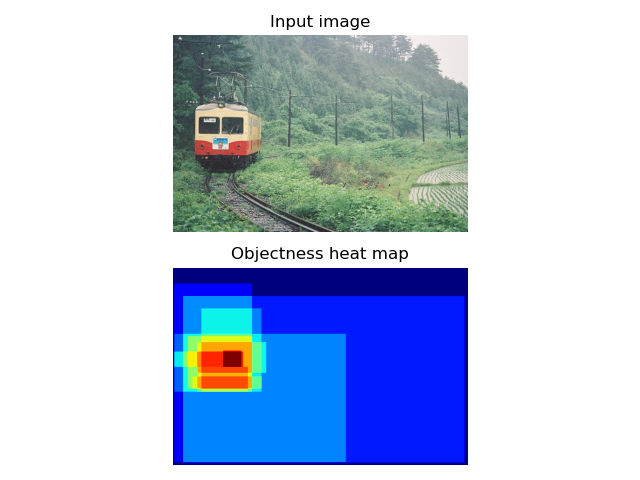

# python-objectness
Python implementation of PAMI 2012 paper "[Measuring the Objectness of Image Windows](https://doi.org/10.1109/TPAMI.2012.28)" and CVPR 2010 paper "[What is an object ?](https://ieeexplore.ieee.org/document/5540226/)".

This implementation is based on the [original matlab code](http://www.vision.ee.ethz.ch/~calvin).

## Results



Comparisons of the original matlab and this python implementation can be found [here.](results/readme.md)

## Get started

1. Clone this repository:

    ```
    git clone https://github.com/RookieHong/python-objectness.git
   ```

2. Install the [requirements](#Requirements) below.

3. Run and see the results:

    ```
    python demo.py
   ```

4. (Optional, but recommended) A python implementation of superpixels segmentation is used as default, you can do the following to use the official C++ implementation through [pybind11](https://github.com/pybind/pybind11) instead (faster and more accurate):

    ```
   # Compile the python interface
   $ sudo apt install cmake   # Install cmake
   $ cd c_segment
   $ mkdir build
   $ cd build
   $ cmake .. && make
   ```
   
   Then, switch from py_segment to c_segment by modifying these two lines in [computeScores.py](computeScores.py):
   ```
   # Comment the py_segment line and uncomment the c_segment line
   
   S = c_segment_img(img=img, sigma=sigma, k=k, min_area=min_area)                         # C segment
   # S = py_segment_img(img=img, sigma=sigma, neighbor=4, K=k, min_comp_size=min_area)     # Python segment
   ```
   

## Requirements
- numpy
- opencv-python
- easydict
- mat4py
- numba

## Notes

Because the implementation of many functions in MATLAB and numpy is different, the results might be slightly different from the original code.

The superpixel computation code in `py-segment` folder is modified from a [python implementation](https://github.com/luisgabriel/image-segmentation), so this will also cause differences in code results.

## Citation

If you find this repository useful, consider citing their paper:

```
@article{alexe2012measuring,
  title={Measuring the objectness of image windows},
  author={Alexe, Bogdan and Deselaers, Thomas and Ferrari, Vittorio},
  journal={IEEE transactions on pattern analysis and machine intelligence},
  volume={34},
  number={11},
  pages={2189--2202},
  year={2012},
  publisher={IEEE}
}
```

```
@inproceedings{alexe2010object,
  title={What is an object?},
  author={Alexe, Bogdan and Deselaers, Thomas and Ferrari, Vittorio},
  booktitle={2010 IEEE computer society conference on computer vision and pattern recognition},
  pages={73--80},
  year={2010},
  organization={IEEE}
}
```