# Comparisons of results

## Combination of cues:

Original: 

Python:

## MS

Original: 

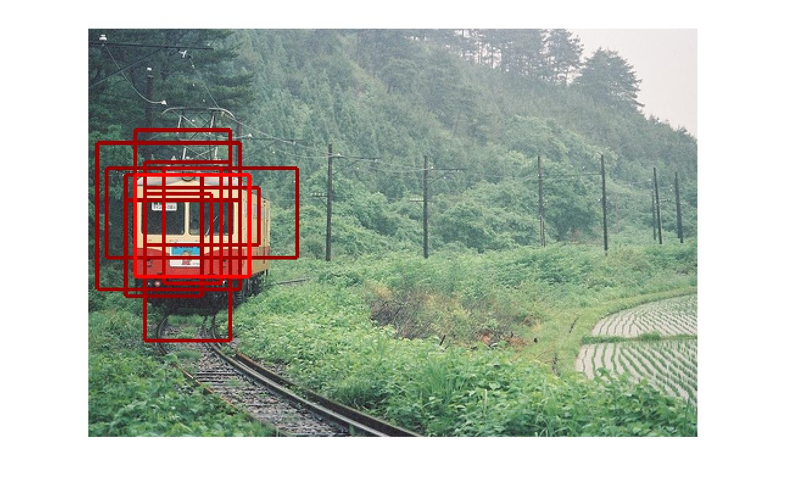
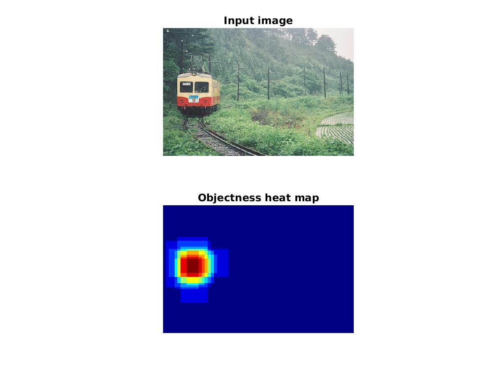

Python:

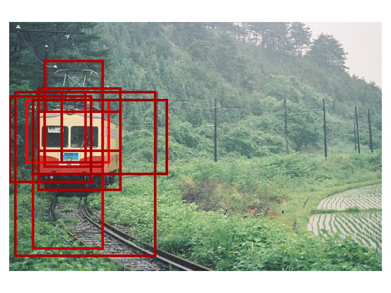
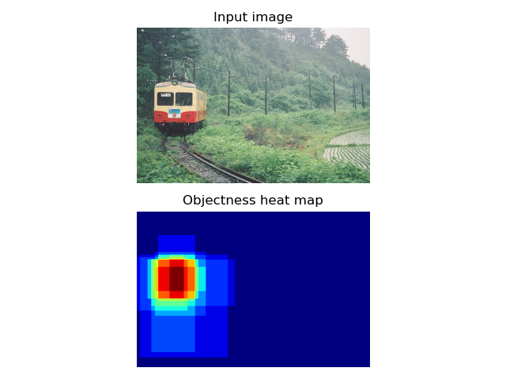

## CC

Original: 

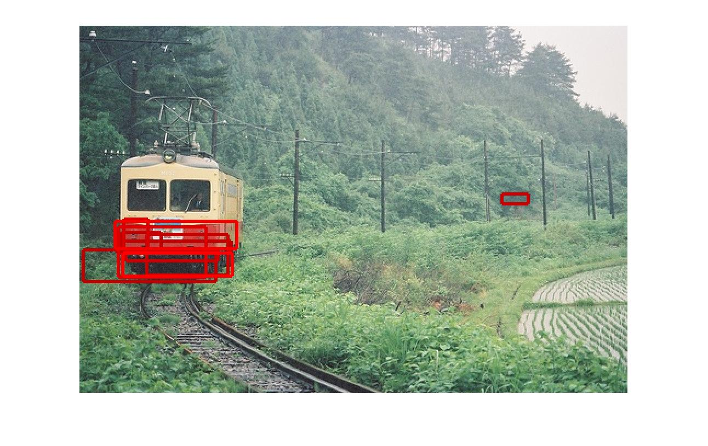
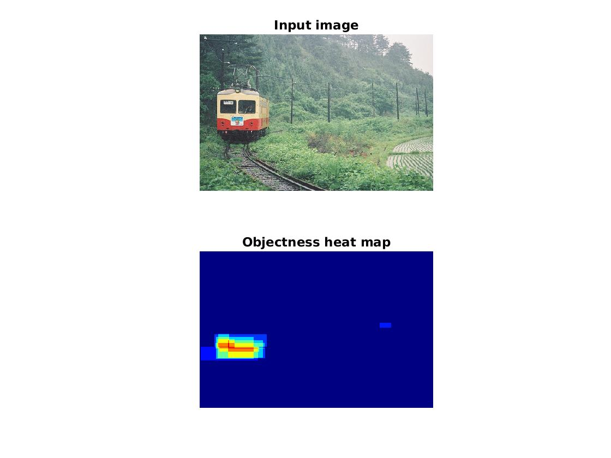

Python:

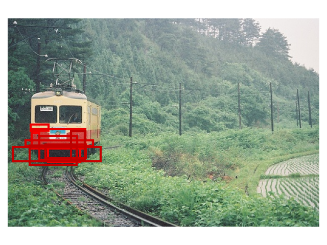
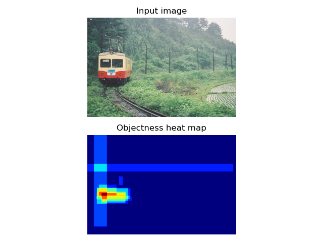

## ED

Original: 

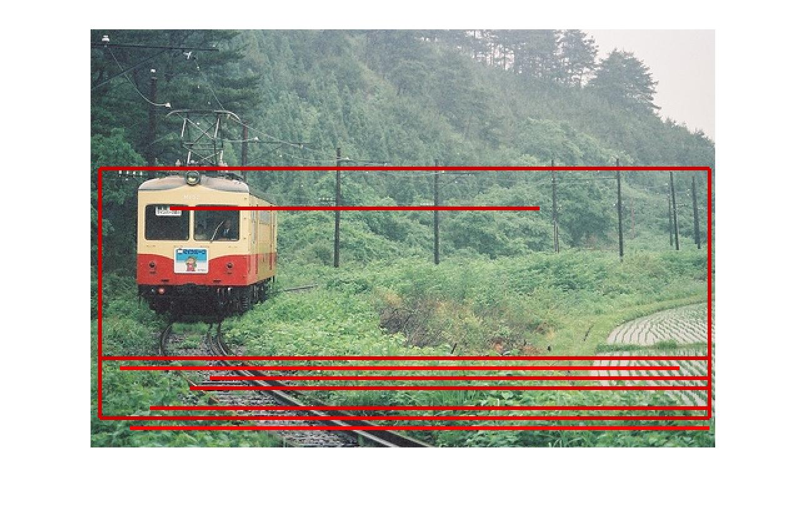
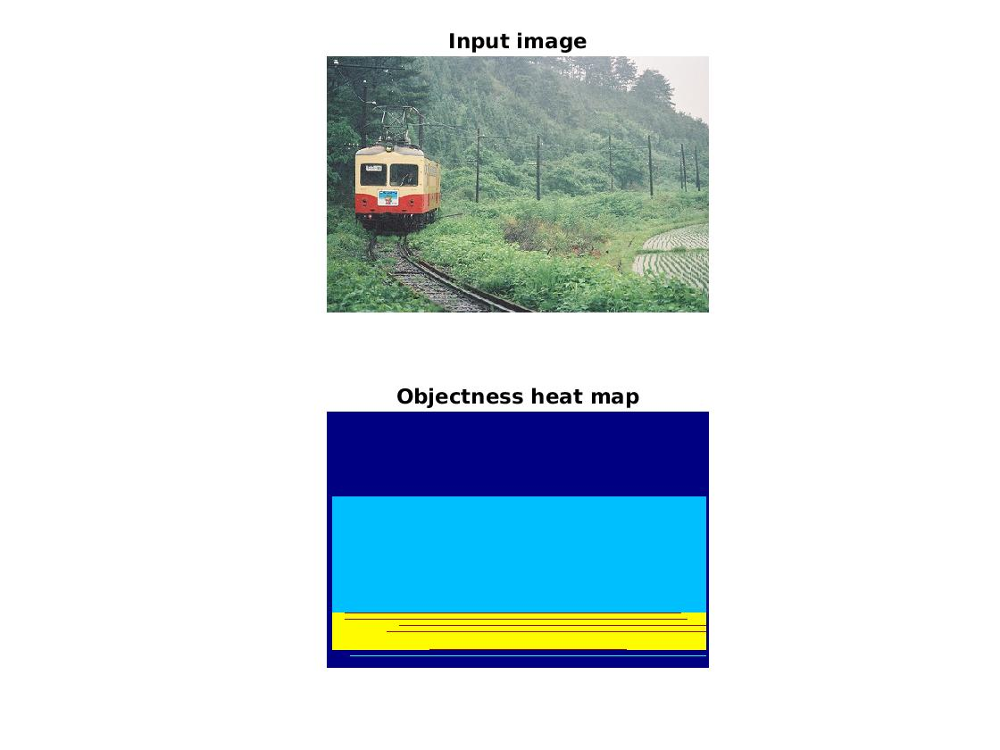

Python:

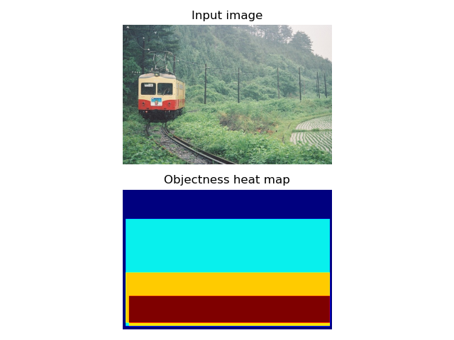

## SS

Original: 

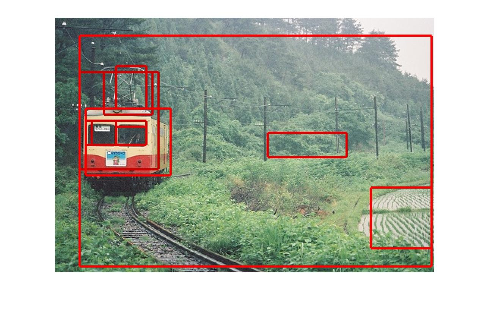
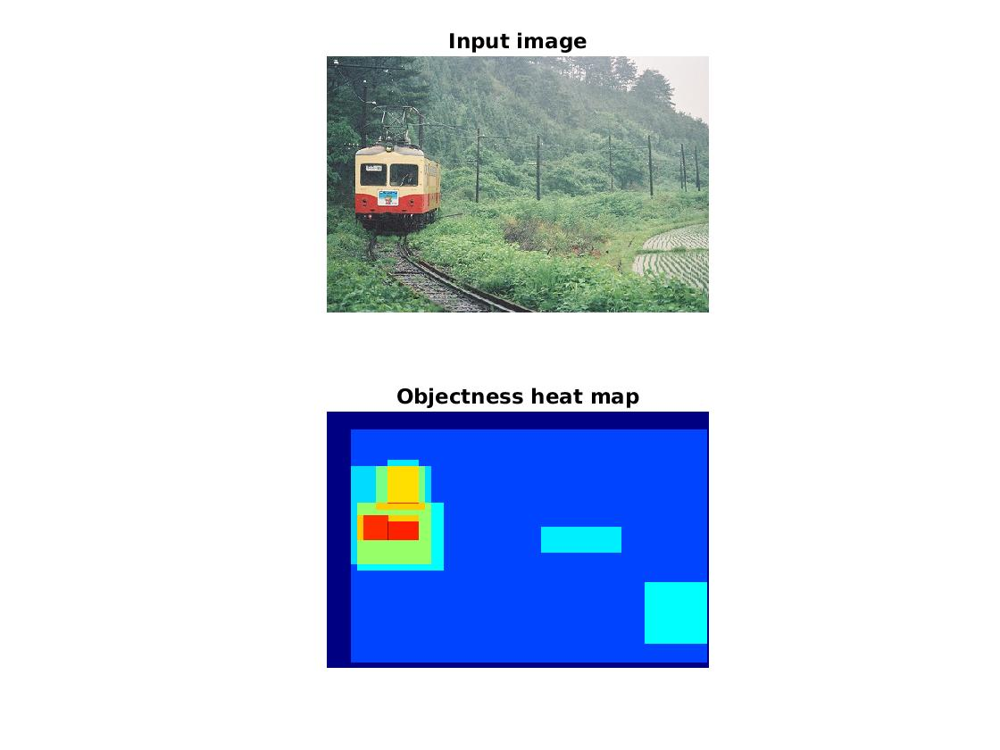

Python:

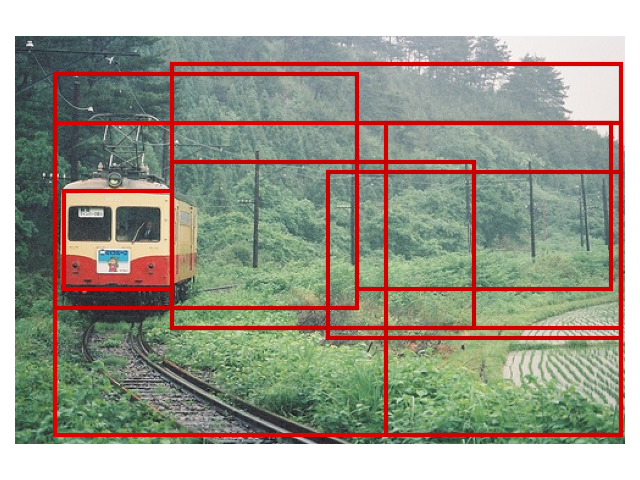
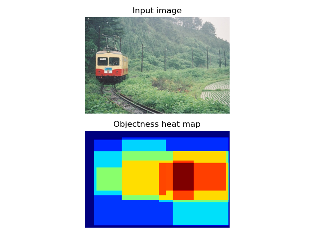